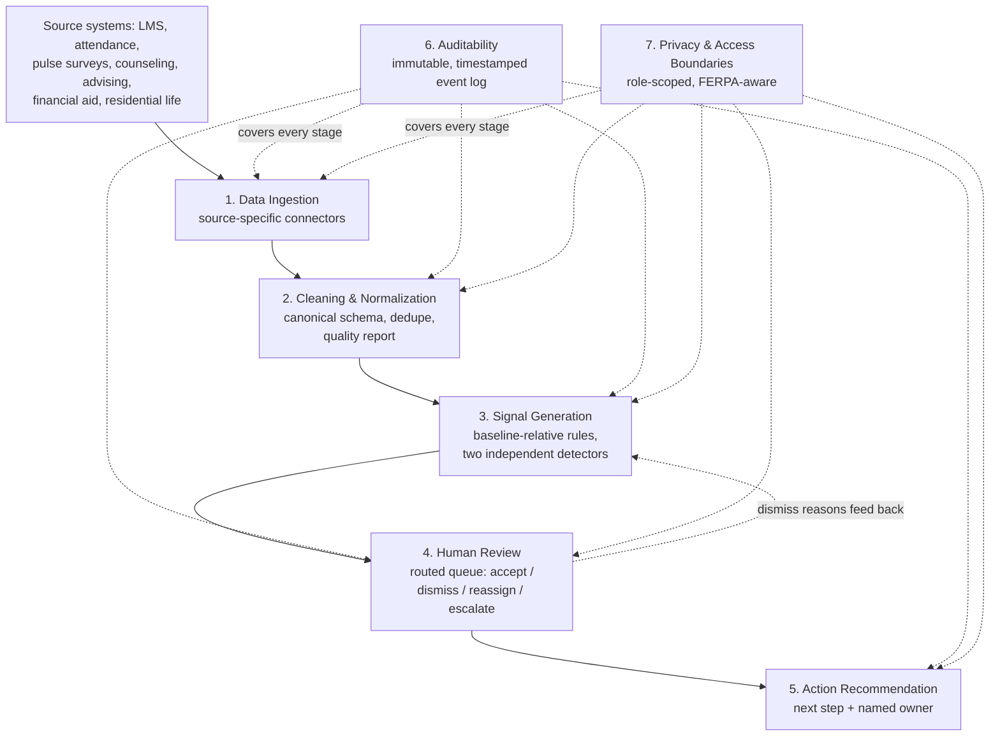

# Architecture

**High Level Explanation:** This describes how the prototype's ideas would turn into an actual product schools could use, not just a script one person runs on their own computer. Think of it as tracing the whole journey a piece of information takes: from the moment a school's system records something (a student missed class, a counselor sent an email) all the way to a staff member seeing a clear, trustworthy alert on their screen and knowing exactly what to do next and who else is already involved. Two things run underneath the whole system the entire time, not just at the end: a record of who did what and when, so nothing important can quietly disappear, and rules about who's allowed to see what, so private student information never ends up somewhere it shouldn't.

**Low Level Explanation:** The prototype's four-stage pipeline (load, clean, engineer features, detect) maps onto a seven-stage production architecture: ingestion, cleaning and normalization, signal generation, human review, action recommendation, auditability, and privacy and access boundaries. The first three map fairly directly onto what already exists in `src/`. The last four, human review, action recommendation, auditability as a real system rather than a printed report, and enforced access control, don't exist in this prototype at all, and represent the actual distance between "a working detector" and "a product." Each stage below lists the options considered, what's recommended at this sprint's scale, and what changes once the data gets bigger and messier.

## Pipeline Overview

Auditability and privacy aren't a final stage, they run underneath all five of the others, which is why they're drawn as cross-cutting rather than as a step at the end of the line.

## 1. Data Ingestion

**Options considered:**
- A. A single generic importer that expects one unified format from every source.
- B. Manual, one-off exports: an office periodically hands over a CSV.
- C. Source-specific connectors, each landing its own raw data as-is into a staging area, with a normalization step handled separately later.

**Recommended for this sprint: C.** Option A breaks the moment a real office system uses a different field name or ID scheme, which our own synthetic data deliberately demonstrates (inconsistent office-name casing across sources). Option B doesn't scale past a handful of manual exports and has no way to catch drift over time. This prototype simulates C in miniature: seven separate CSV files, one per source, each with its own quirks, loaded independently rather than assumed to already agree with each other.

**Scaling to bigger, messier data:** each connector becomes a real integration (an API pull, a database replication job, or a scheduled SFTP transfer) with its own monitoring and failure alerts, since a silent ingestion failure is worse than a slow one. New data sources get a new connector, not a redesign of the whole pipeline. Raw data should land immutably with source and timestamp metadata attached, so nothing is altered before anyone has a chance to see what it originally looked like.

## 2. Data Cleaning and Normalization

**Options considered:**
- A. Clean data ad hoc, inside whatever script happens to need it at the time.
- B. One shared cleaning script, run centrally, that every source is expected to conform to.
- C. A per-source normalization layer mapping into one canonical schema, with every transformation logged rather than applied silently.

**Recommended for this sprint: C.** This is what `src/cleaning.py` actually does: office names get mapped to a canonical set, invalid values get capped or nulled rather than guessed at, duplicates get removed, and every one of those actions is counted in a data-quality report instead of disappearing invisibly. Option A doesn't scale past one script maintainer's memory of what's been fixed where. Option B assumes sources will converge on a shared format, which real institutional systems generally won't.

**Scaling to bigger, messier data:** the canonical office-name mapping currently lives as a hardcoded dictionary in the code; at scale it becomes a maintained reference table an admin can update without a deploy. Deduplication logic needs to be tuned per source, since what counts as "the same event twice" differs by system. The data-quality report becomes a queryable audit trail rather than a printed summary, so a data steward can investigate a specific record's cleaning history months later.

## 3. Signal Generation

**Options considered:**
- A. A single trained model blending every source into one risk score.
- B. Fixed thresholds, hardcoded and uniform across the whole institution.
- C. Configurable, rule-based, per-source detectors comparing each student to their own baseline, with thresholds as adjustable configuration rather than code.

**Recommended for this sprint: C**, minus the "configuration, not code" part, which is itself a named scaling step below. Option A is the black-box approach the brief explicitly cautions against, and there's no real outcome data here to train or validate it against anyway. Option B technically describes what this prototype does today (`MIN_RELATIVE_DECLINE = 0.15` is a Python constant), which is fine for a sprint but not for a real institution with its own tolerance for false positives.

**Scaling to bigger, messier data:** thresholds move out of source code and into an admin-configurable setting per institution, or even per office, since a small counseling office and a large advising office likely have different capacity to act on flags. Computation shifts from a full-dataset batch run to event-triggered processing, so a new data point can raise a flag within hours, not at the next scheduled run. A simple, explainable model (visible coefficients, not a black box) could eventually sit alongside the rules, not replace them, once there's enough real reviewer feedback to check whether the added complexity is actually earning its keep.

## 4. Human Review

**Options considered:**
- A. One shared dashboard, visible to all staff regardless of office or role.
- B. Notifications only (email or similar), with no persistent place to review or track a flag.
- C. A role- and case-routed review queue: flags go to the specific office or person responsible, with accept, dismiss-with-reason, reassign, and escalate actions, and dismiss reasons feeding back into future threshold tuning.

**Recommended for this sprint: C**, though it's worth being direct that none of this exists in the current prototype at all, it only produces CSV files. Option A creates exactly the access-control problem addressed in stage 7. Option B has no memory, so there's no way to tell later whether a flag was ever actually looked at.

**Scaling to bigger, messier data:** this is real interface and workflow software, most usefully built into whatever case management tool each office already uses day to day, rather than a separate system staff have to remember to check. Dismiss reasons are the mechanism that turns this prototype's placeholder thresholds into ones actually tuned against real judgment over time.

## 5. Action Recommendation

**Options considered:**
- A. No recommendation at all, the flag appears and a human decides everything from scratch.
- B. A fixed mapping from flag type straight to a specific action, applied automatically.
- C. A suggested next step and a named owner, generated from the case's type, office, and context, always requiring human approval before anything happens.

**Recommended for this sprint: C.** This maps directly onto HEIAXIS's own thesis: an unowned next step is the actual failure mode, so a recommendation that doesn't also name an owner only solves half the problem. Option A leaves the coordination gap this whole product exists to fix untouched. Option B removes the human judgment this kind of decision genuinely needs, especially at the volume this prototype's own numbers suggest (see `docs/working_prototype.md`).

**Scaling to bigger, messier data:** recommendation logic can get smarter over time, weighted by current staff caseload, or informed by how similar past cases were actually resolved, but it should stay explainable and always remain a suggestion rather than an automated action. Given the FERPA context and the weight a recommendation carries once it touches an educational record, this is not a place to trade explainability for sophistication.

## 6. Auditability

**Options considered:**
- A. Mutable status fields, updated in place, reflecting only the current state with no history.
- B. Periodic database snapshots or backups.
- C. An immutable, timestamped event log for every flag, every review decision, and every reassignment, with full lineage from the original raw record through to the human decision made about it.

**Recommended for this sprint: C.** Option A can't answer "who saw this and when," which matters both operationally and for compliance. Option B captures state at intervals but loses the sequence of decisions in between, which is usually the part someone actually needs to reconstruct later.

**Scaling to bigger, messier data:** this log becomes the mechanism for FERPA disclosure accounting, who accessed what record, when, and under what legitimate educational interest, so it needs to be genuinely tamper-evident and retained far longer than a typical application log would be.

## 7. Privacy and Access Boundaries

HEIAXIS operates in a FERPA-regulated environment, so this stage isn't an add-on, it shapes what the other six stages are allowed to do.

**Options considered:**
- A. Broad access: any staff member can see any student's full record across every office, relying on staff to self-restrict.
- B. Fully siloed access: each office can only ever see its own data, with no visibility into what any other office is doing.
- C. Role- and legitimate-educational-interest-scoped access, enforced technically rather than by policy alone: a coordination gap can be surfaced across offices without necessarily exposing the other office's private case content, only the minimum necessary data reaches the signal-generation layer, and anything beyond direct case handling (model tuning, aggregate reporting) runs on de-identified or aggregated data.

**Recommended for this sprint: C.** Option A relies on trust rather than enforcement, which doesn't hold up as an institution grows past a handful of staff who all know each other. Option B is the more obviously "safe" choice, but it directly breaks the `uncoordinated_multi_office` signal this prototype treats as a first-class continuity gap, since that signal only exists by looking across offices in the first place. C is the only option that lets HEIAXIS's coordination thesis actually work without becoming a privacy liability: it distinguishes between flagging that a gap exists and exposing the private content behind it, which is an access-control decision, not a data-modeling one.

**Scaling to bigger, messier data:** access policy needs to become data-driven (a role and case-assignment table an admin manages) rather than assumed or hardcoded, since manually reasoning about who-can-see-what stops being tractable past a small pilot. This is also the one area across all seven stages where cutting corners for time is least acceptable, even inside a prototype, because the cost of getting it wrong isn't a bug report, it's a real student's record reaching the wrong person.
