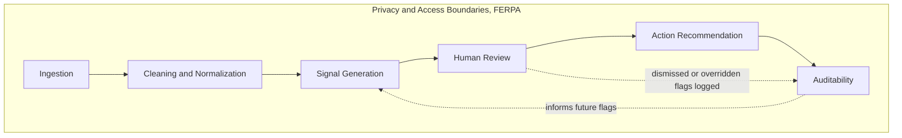

# Architecture

**High Level Explanation:** This document is about what changes when this stops being a sprint prototype and becomes something a real school actually runs. Right now everything lives in a handful of Python scripts that read files and print to a terminal, that's fine for proving the idea works, but it isn't how a real product would run day to day, with new data arriving constantly, dozens of staff needing to see results, and real students' information at stake. This document walks through what a production version would look like, stage by stage, and for each stage explains the choice made and why, plus what would need to change to handle a much bigger, messier school.

**Low Level Explanation:** Seven stages, covering the full path from raw data arriving to a staff member acting on it and someone later being able to check what happened and why: ingestion, cleaning and normalization, signal generation, human review, action recommendation, auditability, and privacy/access boundaries. Each stage below follows the same format used elsewhere in this repository: the alternatives considered, the one chosen and why, and what would specifically need to change to handle a larger, messier, real institution rather than this prototype's clean synthetic dataset.

## Ingestion

**Options considered:**
- A. A single nightly batch job that pulls every source system into one shared database, on a fixed schedule.
- B. Real-time event streaming from every source system, so a change anywhere is reflected within seconds.
- C. Source-specific batch or near-real-time connectors, each landing raw data unchanged into a staging layer, with cadence chosen per source based on how quickly that source actually changes.

**Chosen Answer:** Option A is simple but wrong-shaped for this domain: an LMS activity feed and a financial-aid status update don't need the same freshness, and forcing them onto one schedule means either wasting effort refreshing slow-moving data constantly, or leaving fast-moving data stale. Option B is over-engineered for what this product needs, sub-second freshness doesn't matter when the underlying behavior being detected (a multi-week decline) is inherently slow. C matches ingestion cadence to how quickly each source actually matters, which is both cheaper and more honest about what "early" actually requires here.

**Low Level Explanation:** Each source system (LMS, survey platform, case management systems per office) gets its own ingestion connector, landing data into a staging layer completely unchanged from how the source system sent it, no cleaning or interpretation at this stage. This prototype's `src/generate_data.py` plays the role of every one of these source systems at once, which is exactly why the data it produces is deliberately inconsistent between tables (different office-name casing, different missingness patterns): a real ingestion layer would inherit that inconsistency from genuinely separate systems, not introduce it artificially.

**Scaling to bigger, messier data:** At real institutional scale, ingestion is where most of the actual engineering effort would go, not signal generation. Office systems change vendors, APIs get deprecated, schemas drift without notice. A staging layer that keeps raw, unmodified copies of everything ingested (with a timestamp and source system tag) is what makes it possible to re-run cleaning and signal generation against history when the logic improves, without having to re-collect data that's already been seen once.

## Cleaning and Normalization

**Options considered:**
- A. Push cleaning responsibility upstream, require every source system to send already-standardized data.
- B. Clean silently, drop or correct anything invalid without recording what was changed.
- C. Clean defensively at the boundary, and count and report every correction made, exactly as `src/cleaning.py` does now.

**Chosen Answer:** Option A sounds appealing but isn't realistic, source systems are owned by other offices with their own priorities, and waiting on every upstream system to standardize its exports would block this product indefinitely. Option B is actively dangerous at real scale: a staff member trusting a flag has no way to know whether the underlying data was quietly altered before they saw its effects. C is the only option consistent with a system whose entire value proposition depends on every output being explainable and checkable.

**Low Level Explanation:** This prototype's cleaning step already behaves the way a production system's should: attendance values are capped rather than dropped, negative counts become missing rather than silently zeroed, office names are canonicalized through an explicit lookup table, duplicates are removed, and every single one of these actions is counted and surfaced in a data-quality report a human can read. Nothing is corrected invisibly.

**Scaling to bigger, messier data:** At scale, the canonical-office lookup table used here would need to become a maintained reference table, not a hardcoded dictionary, since office names, mergers, and reorganizations change over a school's lifetime. The data-quality report would need to become a monitored metric over time (a sudden spike in dropped or corrected rows from one source is itself worth alerting on), rather than something only read once per manual run.

## Signal Generation

**Options considered:**
- A. A trained model (even a simple one, like logistic regression) scoring risk directly from raw features.
- B. A hybrid: rules for institutional gaps, a model for student-side risk, blended into a single score.
- C. Fully rule-based, fully explainable detection for both outputs, exactly as `src/signals.py` implements now, with no learned model anywhere.

**Chosen Answer:** Option A requires labeled outcome data this prototype doesn't have and can't manufacture without being circular (see `docs/evaluation_logic.md`), and would produce a score without a checkable reason behind it, exactly the "black-box conclusion" this product is meant to avoid. Option B is the most tempting middle ground, but blending an explainable signal with an opaque one produces an output that's only partially explainable, which in practice means not explainable, since a reviewer can't tell which part of the number to trust. C is slower to improve over time than a model would be, but every single flag it produces can be fully justified to a student, a staff member, or an auditor, which matters more given the stakes.

**Low Level Explanation:** Two independent rule-based detectors, exactly as built: student-side flags require decline across at least two of four independent sources relative to the student's own baseline, and institutional gaps are detected directly from timestamps and null fields in the care-interaction data (a referral open past a threshold, an unanswered outreach with nothing after it, a handoff with no named owner). Neither detector uses population-relative comparisons or a trained model.

**Scaling to bigger, messier data:** As real, human-reviewed outcome data eventually becomes available, a lightweight, still-explainable model (logistic regression, not a black box) could be evaluated side by side against the rule-based approach, not as a replacement, but as a second opinion whose disagreements with the rules become useful information in themselves. The rule thresholds themselves (currently placeholders, like a 15% relative decline) would need to be set collaboratively with an institution's own care staff against their actual tolerance for false positives, not chosen unilaterally by engineering.

## Human Review

**Options considered:**
- A. Fully automated action: the system directly notifies students or updates case records without a human in the loop.
- B. A generic inbox: every flag lands in one shared queue with no ownership or triage.
- C. Role-scoped review queues, where a flag routes to whoever has legitimate educational interest in that specific case, with an explicit accept/dismiss/escalate action recorded against it.

**Chosen Answer:** Option A removes the human judgment this entire product depends on, a wrong automated action taken against a student is a much worse failure mode than a wrong flag sitting in a queue for a person to evaluate. Option B produces exactly the "nobody's job is to follow up" failure this product exists to catch, just one layer further downstream. C keeps a human accountable for every flag while making sure the right human sees it, which is also what makes the auditability stage below meaningful, there's a specific person's decision to log.

**Low Level Explanation:** This prototype doesn't implement a review interface at all, its outputs are ranked CSV files, `flagged_students.csv` and `continuity_gaps.csv`, that a human opens and reads directly, per the brief's explicit instruction not to spend time on UI. A real review stage would need routing logic (which office or advisor owns this student or this case) and a recorded disposition (acted on, dismissed, escalated) for every flag, not just the flag itself.

**Scaling to bigger, messier data:** At scale, review queues need explicit staleness handling of their own, a flag nobody reviews within a reasonable window is itself a continuity gap, which means this stage needs to eventually feed back into the same detection logic that surfaces gaps in the first place. Review load also needs to stay visible against staff capacity (the same `office_caseload_summary.csv` idea from this prototype, made continuous) so flag volume never silently outpaces what a team can actually act on.

## Action Recommendation

**Options considered:**
- A. Prescribe a specific action for every flag (e.g. "send this exact email," "schedule this specific meeting").
- B. No recommendation at all, just the flag and its reason, leaving next steps entirely to the reviewer's judgment.
- C. Suggest a category of response based on the flag's type and leading signal (e.g. "this looks like an outreach gap, consider a direct check-in" versus "this looks like a case-coordination gap, consider looping in the other office"), without prescribing exact wording or action.

**Chosen Answer:** Option A assumes a level of context about the individual student and the appropriate institutional response that this system doesn't and shouldn't have, prescribing a specific action risks the system substituting its judgment for a trained professional's. Option B is safest but wastes the one piece of extra value the system's own categorization already provides, it already knows whether a gap is about unanswered outreach versus poor cross-office coordination, throwing that away means the reviewer starts from zero every time. C uses what the system already knows without overstepping into decisions that should stay human.

**Low Level Explanation:** This prototype doesn't implement action recommendation, it stops at the ranked, explained flag itself, again per the brief's scope. A production version's `gap_type` and `leading_signal` fields (already present in this prototype's output) are the natural hook for a recommendation layer: they already categorize what kind of problem was found, which is most of what a recommendation needs to be useful without being prescriptive.

**Scaling to bigger, messier data:** Any recommendation layer would need close review from whoever owns clinical and academic policy at the institution, a suggested action is a much higher-stakes thing to get wrong than a flag with a reason attached, since it more directly shapes what a staff member actually does. It would also need to be versioned and auditable in its own right (which recommendation logic produced which suggestion, and when it changed).

## Auditability

**Options considered:**
- A. Log only final outcomes (a case was eventually resolved or not), without recording the intermediate flags and decisions that led there.
- B. Log everything, including full raw source data, in a single mutable table that gets updated in place as cases progress.
- C. An immutable, append-only log of every flag raised, every review decision made against it, and every action recorded, kept separate from the operational tables it describes.

**Chosen Answer:** Option A can't answer the most important auditability question this product needs to answer, "was this flag seen, and what happened after," which is the entire execution-failure thesis this product is built around. Option B creates a real risk: a mutable log can be edited after the fact, which defeats the purpose of an audit trail entirely, and mixing raw source data into the same log as decisions makes access control much harder to reason about. C keeps the audit trail trustworthy specifically because it can't be altered after the fact, and keeps it separate from operational data so access to "what happened" doesn't require access to the underlying student records themselves.

**Low Level Explanation:** This prototype's data-quality report (`data_quality_report.txt`) is a small-scale version of this idea, an explicit, countable record of what was changed and why. A production auditability layer would extend that same principle to every stage: which flag was raised on which data, who reviewed it and when, what they decided, and what happened next, recorded once and never overwritten.

**Scaling to bigger, messier data:** At real scale, this log itself becomes a valuable and sensitive dataset, useful for improving detection logic over time (which flags actually led to helpful action, versus dismissed ones), but also itself subject to the same access-control and retention questions as the student data it describes, which is exactly why the next stage exists.

## Privacy and Access Boundaries (FERPA)

**Options considered:**
- A. Treat privacy as a policy document, separate from the system, that staff are trained on but the software doesn't enforce.
- B. Restrict access at the office level only (e.g. "Counseling can see everything Counseling has ever touched"), mirroring how offices are already siloed today.
- C. Enforce access at the system level based on legitimate educational interest and minimum-necessary data for the task at hand, scoped per role and per case, not per office wholesale.

**Chosen Answer:** Option A puts the entire burden of compliance on individual staff remembering and following a policy, which is exactly the kind of unenforced process gap this product's own thesis says institutions fail at. Option B is closer, but still over-grants, an advisor in Counseling doesn't have a legitimate educational interest in every student Counseling has ever touched, only the ones assigned to them. C is the only option that actually enforces FERPA's own standard, legitimate educational interest and minimum necessary access, in the system itself rather than trusting it to be followed outside the system.

**Low Level Explanation:** This prototype doesn't implement access control at all, it's a set of local scripts run against synthetic data with no real students in it, so there's nothing to protect yet. A production version would need role-scoped access (a reviewer sees only cases assigned to them, not the full flagged-student list), minimum-necessary field-level access (a financial-aid reviewer doesn't need to see belonging-survey responses), and the immutable audit log from the previous stage recording every access, not just every action, so "who looked at this student's data, and were they allowed to" is always answerable.

**Scaling to bigger, messier data:** This is the stage that most needs real institutional involvement before any of the rest of this architecture gets built for real, whoever owns FERPA compliance and data governance at an institution should be involved from the start of a production build, not brought in after a working prototype already exists. Access boundaries designed after the fact tend to become a retrofit bolted onto an existing system rather than a real design constraint the rest of the system was built around.
